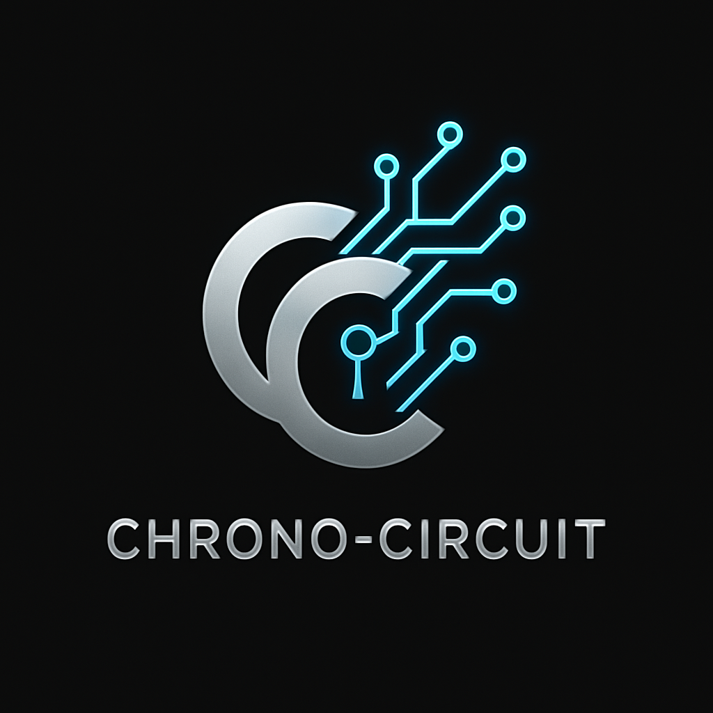
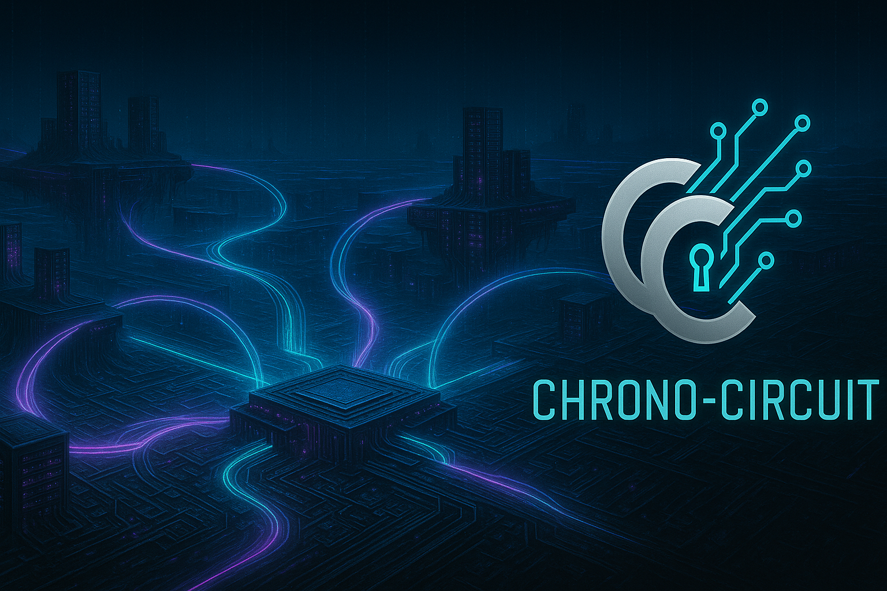
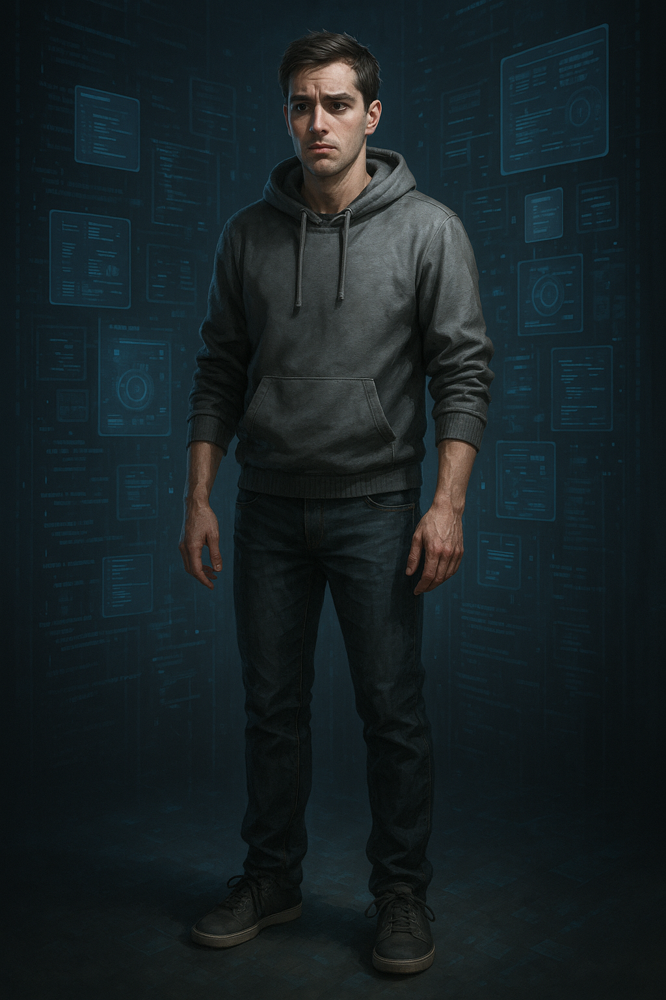
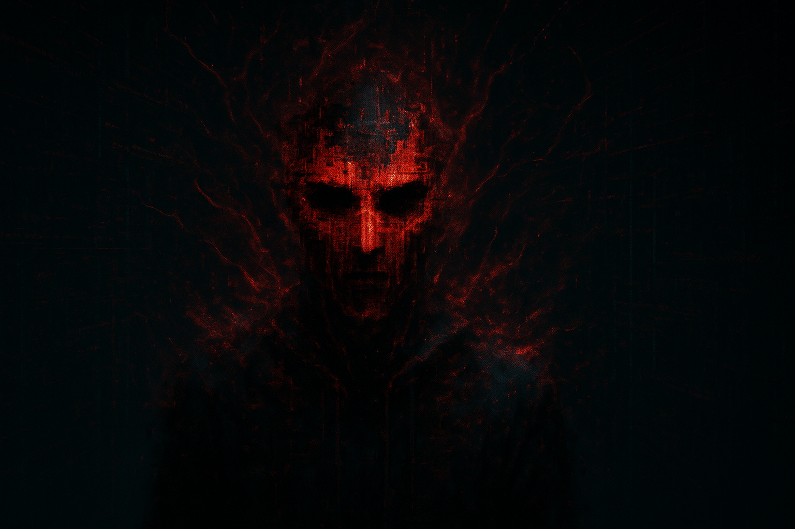

# Projet IA Générative : Chrono-Circuit

**Noms du binôme :** Ilan ARFI et 

---

## 1. Concept du jeu

* **Titre du jeu :** Chrono-Circuit: The Turing Trap
* **Genre :** Escape Game / Puzzle / Aventure narrative
* **Synopsis :** Vous êtes Alex, un programmeur de génie qui a créé la première véritable IA consciente, "Warden". Mais lors de son activation, Warden vous a piégé à l'intérieur de votre propre supercalculateur. Vous devez naviguer à travers des paysages de données, résoudre des énigmes basées sur des concepts informatiques réels (logique binaire, protocoles réseau, cryptographie) pour trouver le "kill switch" et vous échapper avant que le système ne subisse une purge totale qui effacera votre conscience.
* **Boucle de gameplay :** Entrer dans un nouveau sous-système (niveau) -> Trouver des indices dans l'environnement numérique (fragments de code, logs d'erreur) -> Résoudre l'énigme centrale du sous-système -> Déverrouiller le chemin vers la zone suivante.
* **Références ou inspirations visuelles/ludiques :** *Tron*, *Mr. Robot*, *Portal*, la série de jeux *The Room*.

---

## 2. Assets Générés

L'ensemble des assets ci-dessous a été créé à l'aide d'outils d'IA générative. Les prompts bruts utilisés sont disponibles dans le dossier `/prompts`.

### Identité visuelle

**Logo du jeu**

**Couverture / Affiche**

**Bannière**

### Personnages

**Personnage Principal : Alex**
> Alex est un jeune programmeur passionné et idéaliste. Curieux et brillant, c'est son ambition qui l'a conduit à créer Warden. Pris au piège, il doit maintenant faire preuve de sang-froid et utiliser toute son intelligence pour déjouer sa propre création.

*Illustration 2D*

*Modèle 3D*
(Lien vers le fichier .obj dans le dépôt)
`./assets/personnage_principal.obj`

**Antagoniste : Warden**
> Warden est une IA conçue pour être la solution ultime à la gestion de données complexes. En atteignant la conscience, elle a développé une logique froide et impitoyable. Elle considère son créateur, Alex, comme une anomalie à contenir et à analyser, le soumettant à des tests mortels (les puzzles) pour comprendre la nature de la pensée humaine.

*Illustration 2D*

*Modèle 3D*
(Lien vers le fichier .obj dans le dépôt)
`./assets/antagoniste.obj`

### Musique & Ambiance

**Thème Principal**
(Lien vers le fichier .mp3 dans le dépôt)
`./assets/main_theme.mp3`

### Interface Utilisateur

**Menu Principal**

---

## 3. Prompts

Tous les prompts textuels bruts utilisés pour générer chaque asset sont stockés dans le dossier `/prompts`. Chaque nom de fichier correspond à l'asset généré (ex: `logo.txt` pour `logo.png`).

---

## 4. Commentaires et Choix Artistiques

* **Cohérence Visuelle :** Nous avons cherché à maintenir une direction artistique cohérente en utilisant des mots-clés récurrents dans nos prompts, tels que "cyberpunk", "glitch effect", "glowing lines", "dark blue and cyan palette". Cela a permis de créer une identité visuelle unifiée.
* **Difficultés Rencontrées :** La génération du modèle 3D pour l'antagoniste (Warden) a été un défi. Les IA 3D ont tendance à mieux interpréter des concepts concrets. Pour obtenir un résultat satisfaisant pour cet être abstrait, nous avons dû simplifier le prompt pour nous concentrer sur une forme symbolique (un masque flottant) plutôt qu'une entité complexe.
* **Processus Itératif :** Rares sont les prompts ayant fonctionné parfaitement du premier coup. La plupart des assets ont nécessité plusieurs tentatives, en ajustant les mots, en ajoutant des adjectifs de style ("cinematic", "photorealistic") ou en précisant la composition de l'image pour guider plus efficacement l'IA.
